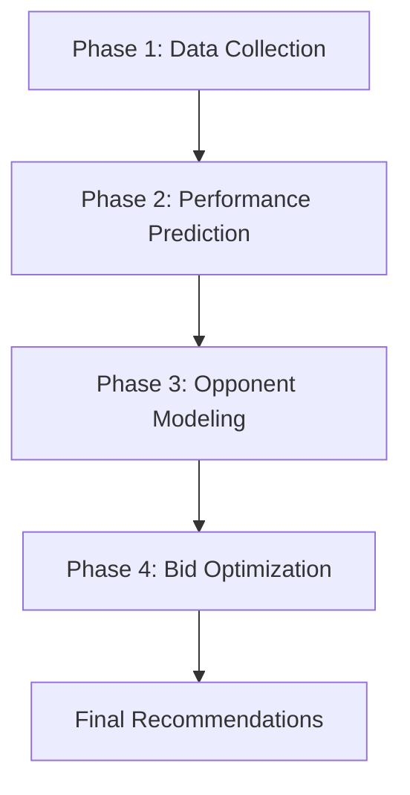

# ⚽ Fantacalcio AI-Powered Recommendation Engine

An intelligent bid optimization system for Italian Fantacalcio sealed-bid auctions using machine learning, opponent modeling, and mathematical optimization.

## 📋 Table of Contents
- [Overview](#overview)
- [Features](#features)
- [Project Structure](#project-structure)
- [Installation](#installation)
- [Quick Start](#quick-start)
- [Detailed Usage](#detailed-usage)
- [Architecture](#architecture)
- [Configuration](#configuration)
- [API Reference](#api-reference)
- [Troubleshooting](#troubleshooting)
- [Contributing](#contributing)

## 🎯 Overview

This AI-powered system helps Fantacalcio managers optimize their bidding strategy for sealed-bid auctions by:

1. **Collecting player data** from multiple sources (Fantacalcio.it, FBref, Transfermarkt)
2. **Predicting player performance** using advanced machine learning models
3. **Modeling opponent behavior** based on historical auction data
4. **Optimizing bid strategy** through mathematical programming

### Auction Rules Supported
- **League Size**: 12 managers
- **Budget**: 500 million per manager
- **Roster**: 3 Goalkeepers, 7 Defenders, 7 Midfielders, 5 Forwards
- **Format**: Single simultaneous sealed-bid auction
- **Tie-Breaker**: Tied bids result in no assignment

## ✨ Features

### 🤖 AI-Powered Analysis
- **Machine Learning Predictions**: XGBoost/LightGBM models with advanced feature engineering
- **Opponent Modeling**: Behavioral analysis of competing managers
- **Market Intelligence**: Dynamic price estimation and win probability calculation
- **Risk Assessment**: Customizable risk tolerance with risk-adjusted recommendations

### 📊 Smart Optimization
- **Mathematical Optimization**: Integer programming for optimal bid allocation
- **Budget Constraints**: Ensures total bids stay within 500M budget
- **Roster Requirements**: Automatically meets position constraints (3-7-7-5)
- **Value Maximization**: Optimizes expected fantasy score across entire roster

### 🔧 Production Ready
- **Robust Error Handling**: Graceful fallbacks when web scraping fails
- **Comprehensive Logging**: Detailed progress tracking and debugging
- **Flexible Configuration**: Adjustable parameters for different strategies
- **Export Capabilities**: CSV export for all analysis results

## 📁 Project Structure

```
fantacacio2025/
├── README.md                           # This documentation
├── requirements.txt                    # Python dependencies
├── main.py                            # Main entry point
├── CLAUDE.md                          # Development guidance
└── antoninorau/                       # Main package
    ├── __init__.py                    # Package initialization
    └── fantacalcio/                   # Fantacalcio AI system
        ├── __init__.py                # Module exports
        ├── fantacalcio_recommender.py # Main integration module
        ├── data_collection.py         # Phase 1: Data scraping and structuring
        ├── performance_prediction.py  # Phase 2: ML performance models
        ├── opponent_modeling.py       # Phase 3: Opponent behavior analysis
        └── bid_optimization.py        # Phase 4: Mathematical optimization
```

### Module Descriptions

| Module | Purpose | Key Classes/Functions |
|--------|---------|----------------------|
| `antoninorau.fantacalcio.data_collection` | Web scraping from football sources | `FantacalcioDataCollector` |
| `antoninorau.fantacalcio.performance_prediction` | ML-based player performance prediction | `FantacalcioPredictor`, `predict_player_performance()` |
| `antoninorau.fantacalcio.opponent_modeling` | Market analysis and opponent behavior | `OpponentModeler` |
| `antoninorau.fantacalcio.bid_optimization` | Mathematical optimization engine | `BidOptimizer`, `suggest_bids()` |
| `antoninorau.fantacalcio.fantacalcio_recommender` | Complete pipeline integration | `FantacalcioRecommender` |

## 🚀 Installation

### Prerequisites
- Python 3.8+
- Internet connection (for web scraping)

### Setup

1. **Clone or download the project:**
```bash
git clone <repository-url>
cd fantacacio2025
```

2. **Install dependencies:**
```bash
pip install -r requirements.txt
```

3. **Verify installation:**
```bash
python -c "import pandas, numpy, sklearn, xgboost, lightgbm, pulp; print('All dependencies installed successfully!')"
```

## ⚡ Quick Start

### Basic Usage (5 minutes)

```python
from antoninorau.fantacalcio import FantacalcioRecommender

# Initialize the system
recommender = FantacalcioRecommender()

# Generate complete recommendations
results = recommender.run_complete_analysis(
    budget=500,
    risk_tolerance=0.7,
    save_results=True
)

# View recommendations
print(results['recommendations'])
```

### Command Line Usage

```bash
python main.py
```

This will:
- Collect player data (web scraping or sample data)
- Generate ML predictions
- Analyze market conditions
- Optimize bid strategy
- Save results to CSV files
- Display comprehensive summary

## 📚 Detailed Usage

### 1. Data Collection

```python
from antoninorau.fantacalcio import FantacalcioDataCollector

collector = FantacalcioDataCollector()

# Collect data for multiple seasons
df = collector.create_master_dataframe(seasons=["2024-25", "2023-24", "2022-23"])

# Save collected data
df.to_csv('player_data.csv', index=False)
```

### 2. Performance Prediction

```python
from antoninorau.fantacalcio import predict_player_performance

# Generate predictions using XGBoost
predictions = predict_player_performance(df, model_type='xgboost')

# View top predicted performers
print(predictions.head(10))
```

### 3. Opponent Modeling

```python
from antoninorau.fantacalcio import OpponentModeler
import pandas as pd

# Load your historical auction data
historical_data = pd.read_csv('historical_auctions.csv')

# Initialize opponent model
opponent_model = OpponentModeler(historical_data)

# Estimate market prices
market_analysis = opponent_model.estimate_market_price(predictions)

# Get opponent insights
opponent_summary = opponent_model.get_opponent_summary()
print(opponent_summary)
```

### 4. Bid Optimization

```python
from antoninorau.fantacalcio import suggest_bids

# Generate final recommendations
recommendations = suggest_bids(
    player_df=predictions,
    opponent_model=opponent_model,
    budget=500,
    roster_constraints={'GK': 3, 'DF': 7, 'MF': 7, 'FW': 5},
    risk_tolerance=0.7
)

print(recommendations)
```

## 🏗️ Architecture

### Four-Phase Pipeline



#### Phase 1: Data Collection & Structuring
- **Sources**: Fantacalcio.it, FBref, Transfermarkt
- **Data Types**: Performance stats, market values, player info
- **Output**: Structured pandas DataFrame

#### Phase 2: Player Performance Prediction
- **Algorithm**: XGBoost/LightGBM with advanced feature engineering
- **Features**: Lagged variables, age curves, position-specific metrics
- **Output**: Predicted fantasy scores for upcoming season

#### Phase 3: Opponent Behavior & Bid Prediction
- **Analysis**: Historical bidding patterns, manager profiles
- **Modeling**: Market price estimation, win probability calculation
- **Output**: Market intelligence and opponent insights

#### Phase 4: Optimization & Bid Suggestion
- **Method**: Integer Linear Programming (ILP)
- **Objective**: Maximize expected fantasy score
- **Constraints**: Budget limit, roster composition
- **Output**: Optimal bid amounts for 22-player roster

## ⚙️ Configuration

### Risk Tolerance Settings

| Level | Value | Description | Bidding Strategy |
|-------|-------|-------------|------------------|
| Conservative | 0.5 | Lower risk, higher win probability | Bid closer to market price |
| Moderate | 0.7 | Balanced approach | Default recommendation |
| Aggressive | 0.9 | Higher risk, potential for bargains | Bid above market price |

### Roster Constraints

```python
roster_constraints = {
    'GK': 3,  # Goalkeepers
    'DF': 7,  # Defenders  
    'MF': 7,  # Midfielders
    'FW': 5   # Forwards
}
```

### Budget Settings

```python
# Default budget per manager
TOTAL_BUDGET = 500  # Million

# Minimum bid amount
MIN_BID = 1  # Million

# Maximum reasonable bid for any player
MAX_BID = 150  # Million
```

## 📖 API Reference

### FantacalcioRecommender Class

#### Main Methods

```python
class FantacalcioRecommender:
    def __init__(self, historical_auction_data=None)
    def run_complete_analysis(self, budget=500, risk_tolerance=0.7, save_results=True)
    def collect_current_season_data(self, seasons=None)
    def generate_performance_predictions(self, player_data)
    def generate_final_recommendations(self, budget=500, roster_constraints=None, risk_tolerance=0.7)
```

#### Parameters

- **budget** (int): Total budget available (default: 500)
- **risk_tolerance** (float): Risk level 0-1 (default: 0.7)
- **roster_constraints** (dict): Position requirements (default: 3-7-7-5)
- **save_results** (bool): Whether to save CSV files (default: True)

### Key Data Structures

#### Player Data DataFrame
```python
columns = [
    'player_name', 'season', 'age', 'team', 'position',
    'games_played', 'minutes_played', 'goals', 'assists',
    'fantavoto_avg', 'market_value', 'yellow_cards', 'red_cards'
]
```

#### Recommendations DataFrame
```python
columns = [
    'player_name', 'position', 'predicted_fantasy_score',
    'recommended_bid', 'estimated_market_price', 'win_probability',
    'expected_value', 'value_efficiency', 'risk_level', 'alternatives'
]
```

## 🔧 Troubleshooting

### Common Issues

#### 1. Web Scraping Failures
**Problem**: "No data collected from web sources"
**Solution**: 
- Check internet connection
- System automatically falls back to sample data
- For production use, consider implementing data caching

#### 2. Optimization Infeasible
**Problem**: "Optimization status: Infeasible"
**Solution**:
- Reduce risk_tolerance parameter
- Increase budget if possible
- Check roster_constraints are achievable
- System provides fallback greedy solution

#### 3. Missing Dependencies
**Problem**: Import errors for required packages
**Solution**:
```bash
pip install -r requirements.txt
```

#### 4. Performance Issues
**Problem**: Slow execution with large datasets
**Solution**:
- Reduce number of seasons in data collection
- Use 'lightgbm' instead of 'xgboost' for faster training
- Limit number of players per position in optimization

### Debug Mode

Enable detailed logging:
```python
import logging
logging.basicConfig(level=logging.DEBUG)
```

### Data Validation

Check data quality:
```python
# Validate player data
print(f"Players: {df['player_name'].nunique()}")
print(f"Seasons: {df['season'].unique()}")
print(f"Positions: {df['position'].value_counts()}")
print(f"Missing values: {df.isnull().sum().sum()}")
```

## 🎯 Advanced Usage

### Custom Historical Data

If you have your own historical auction data:

```python
# Expected format
historical_data = pd.DataFrame({
    'player_name': ['Vlahovic', 'Lautaro', ...],
    'winning_bid': [65, 70, ...],
    'winning_manager': ['Manager_A', 'Manager_B', ...],
    'season': ['2023-24', '2023-24', ...],
    'position': ['FW', 'FW', ...],
    'predicted_fantasy_score': [85, 82, ...]
})

recommender = FantacalcioRecommender(historical_data)
```

### Sensitivity Analysis

Test different risk levels:

```python
from antoninorau.fantacalcio import BidOptimizer, RosterConstraints

optimizer = BidOptimizer(RosterConstraints())
sensitivity = optimizer.analyze_sensitivity(
    player_df=predictions, 
    opponent_model=opponent_model,
    risk_levels=[0.3, 0.5, 0.7, 0.9]
)
print(sensitivity)
```

### Custom Feature Engineering

Extend the prediction model:

```python
from antoninorau.fantacalcio import FantacalcioPredictor

predictor = FantacalcioPredictor()
# Add custom features to the dataframe before training
df['custom_feature'] = df['goals'] / df['age']
```

## 📊 Output Files

When `save_results=True`, the system generates:

| File | Description |
|------|-------------|
| `fantacalcio_player_data.csv` | Raw collected player data |
| `fantacalcio_predictions.csv` | ML performance predictions |
| `fantacalcio_market_analysis.csv` | Market price analysis |
| `fantacalcio_recommendations.csv` | **Final bid recommendations** |
| `fantacalcio_opponent_summary.csv` | Opponent behavior analysis |

## 🏆 Performance Metrics

The system tracks several key metrics:

- **Model Accuracy**: R² score for prediction models
- **Win Probability**: Estimated chance of winning each bid
- **Value Efficiency**: Expected fantasy points per million spent
- **Budget Utilization**: Percentage of budget allocated
- **Risk Distribution**: Balance of low/medium/high risk bids

## 🔮 Future Enhancements

Potential improvements for the system:

1. **Real-time Data**: Integration with live APIs
2. **Advanced ML**: Deep learning models, ensemble methods
3. **Dynamic Optimization**: Real-time bid adjustment during auction
4. **Mobile Interface**: Web or mobile app frontend
5. **League Integration**: Direct integration with Fantacalcio platforms

## 🤝 Contributing

We welcome contributions! Areas for improvement:

- **Data Sources**: Additional web scraping targets
- **ML Models**: New prediction algorithms
- **Optimization**: Advanced mathematical programming techniques
- **Testing**: Unit tests and validation frameworks
- **Documentation**: Examples and tutorials

## 📄 License

This project is provided as-is for educational and research purposes. Please respect the terms of service of data sources when web scraping.

## 🙋‍♂️ Support

For questions and support:

1. Check the [Troubleshooting](#troubleshooting) section
2. Review the [API Reference](#api-reference)
3. Examine the code comments and docstrings
4. Create an issue with detailed error information

---

**🚀 Ready to dominate your Fantacalcio league with AI? Let's get started!**

```bash
python main.py
```